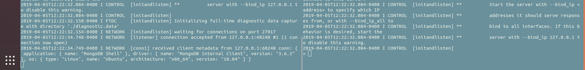
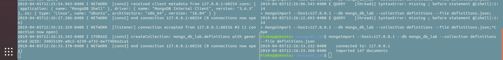
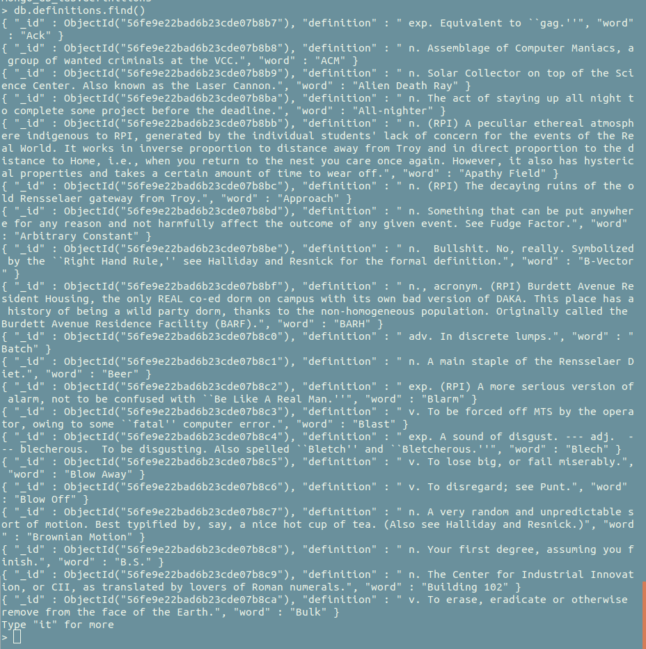
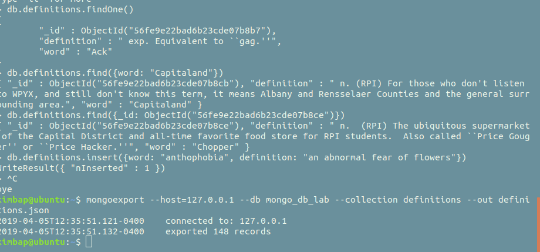
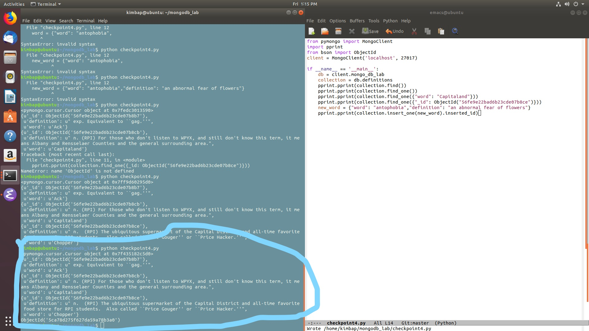
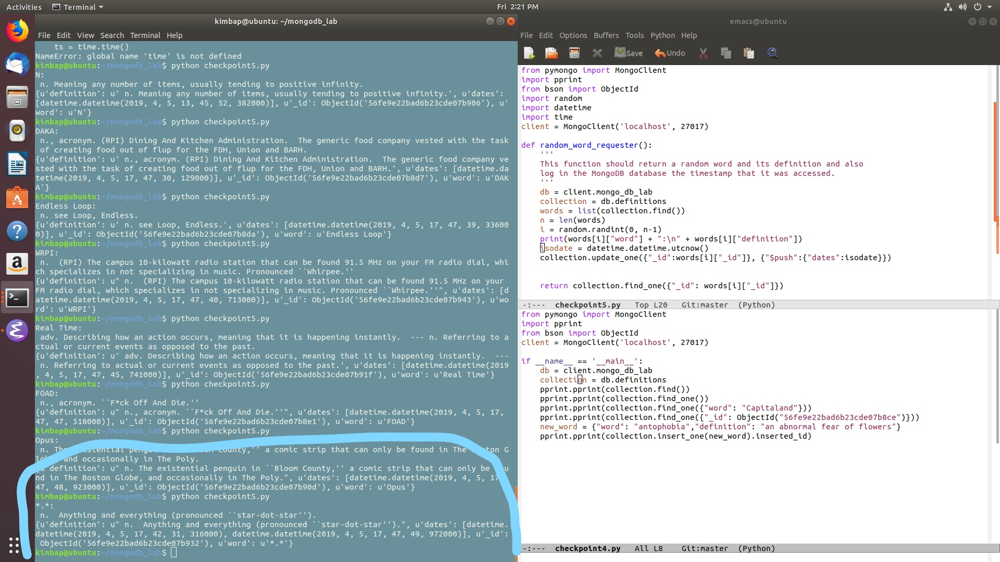

# Issac Kim
# kimi6

## 1
Making the connection with the mongo server.

## 2
Import the definitions.json file into the mongo db.

## 3
Using find to look at all of the definitions.

The specific query functions, insert, and export

## 4
The terminal has a portion circled, which is the output of the python file. The last line gives the id of the newly inserted word.

## 5
The terminal has a portion circled, which is the output of the python file. It contains the word and the definition. The bottom shows that there are two datestamps.  

