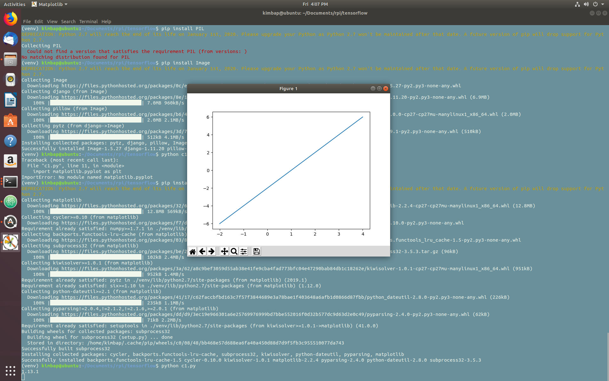
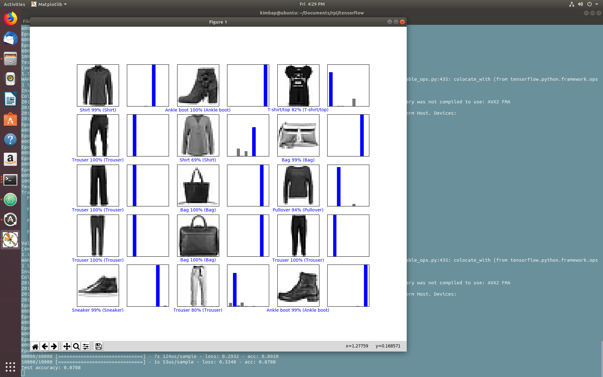
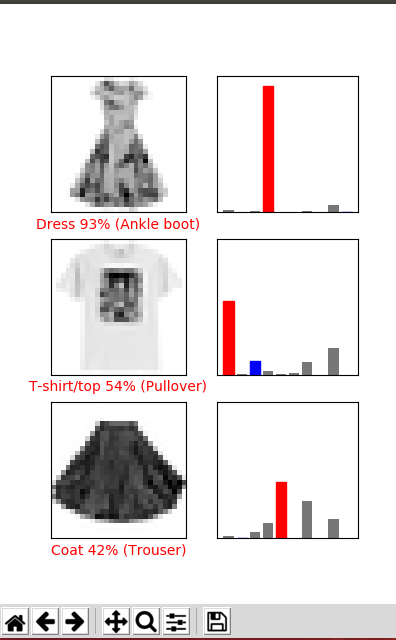

# Issac Kim
# kimi6

## 1
Testing to make sure that tensorflow works properly on my machine

## 2
Reconfiguring the examples tensorflow to work with different index of images.

## 3
Try testing tensorflow on images from the internet. Seemed to have bad accuracy,
espcially because of the cropping of images from their natural resolution to
28x28 led to choppy images. 

