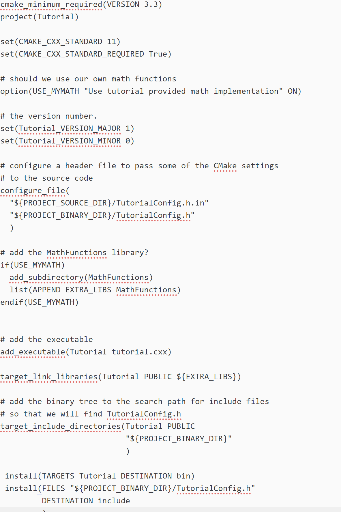

# Issac Kim

# Part 0

# Step 1
Running the first cmake

Running tutorial

cmake file

# Step 2
mysqrt.cxx file with if statements

cmake file

# Step 3
Output for step 3

cmake file

# Step 4
cmake file

# Step 5
cmake file in MathFunction

cmake file

mysqrt

