# Issac Kim
# kimi6

## Part 3: "Data Visualization with ggplot2 (Part 1)"
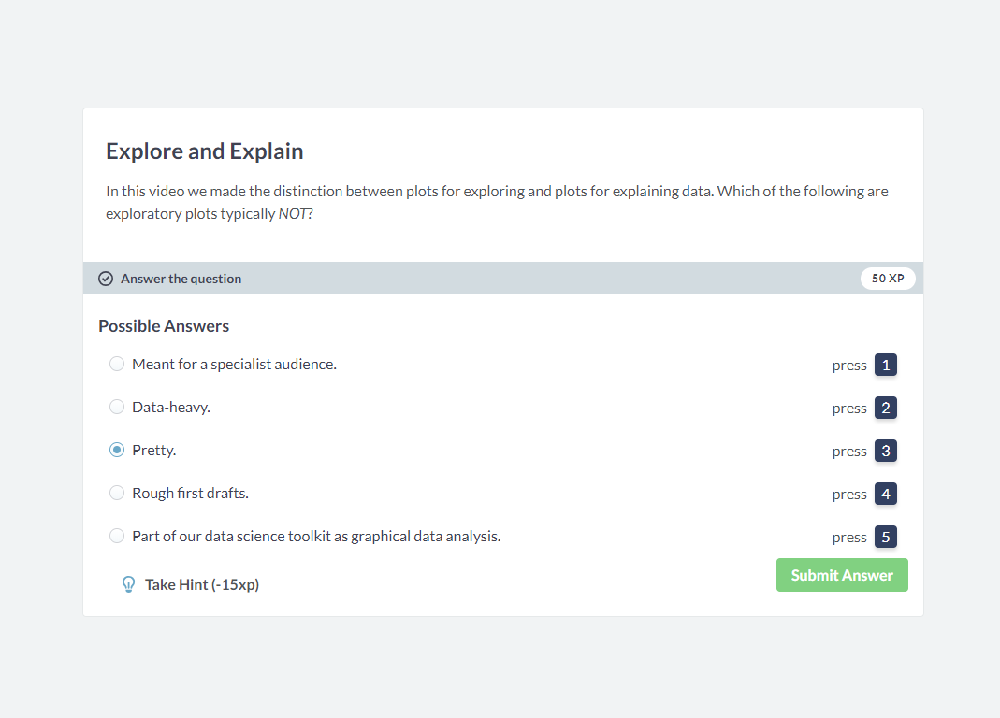
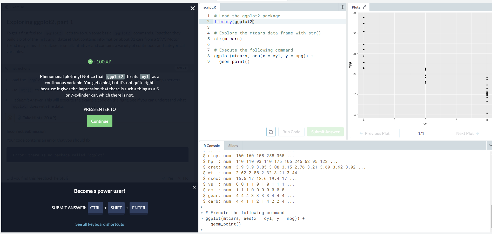
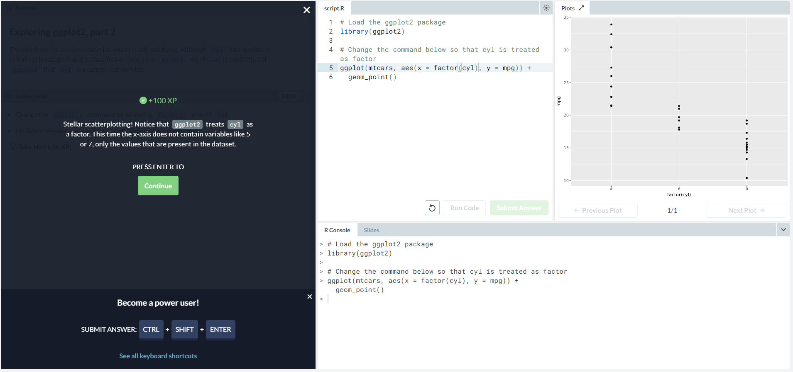
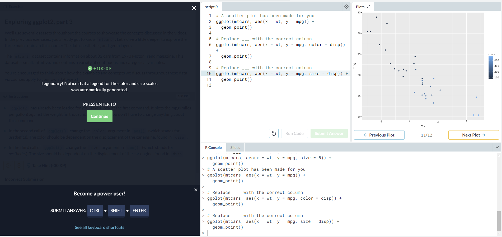
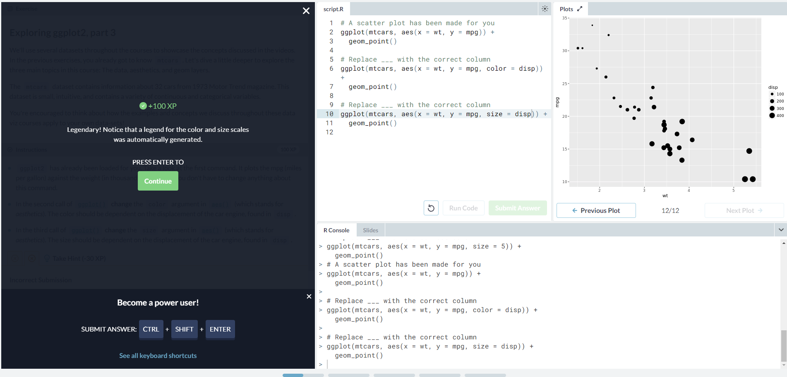
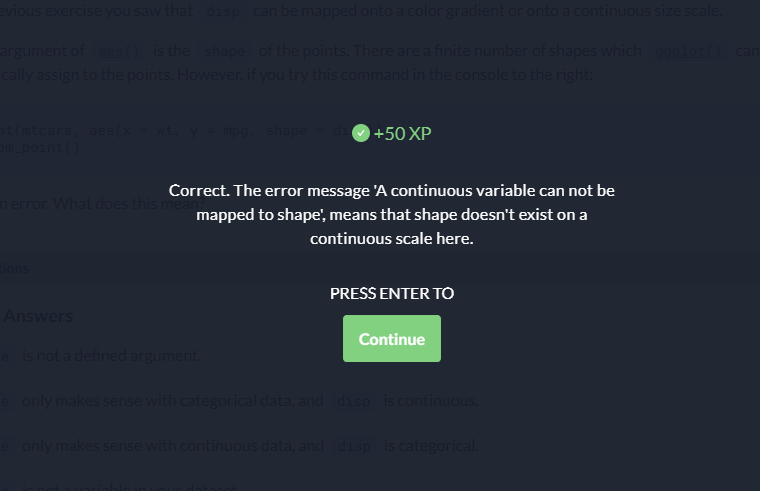
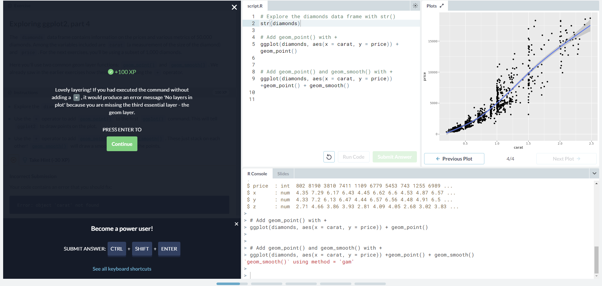
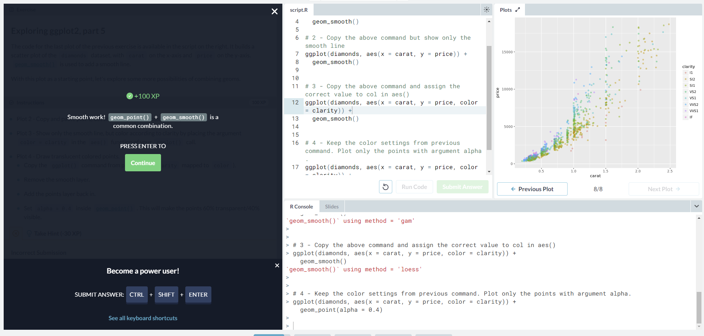
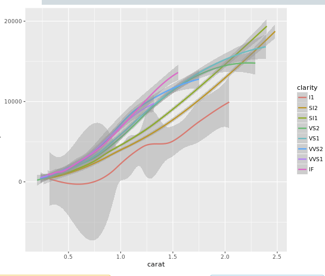
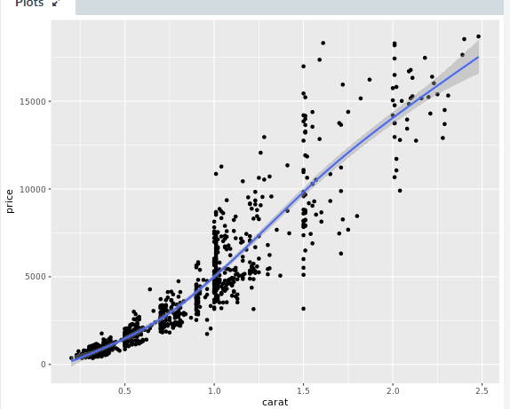
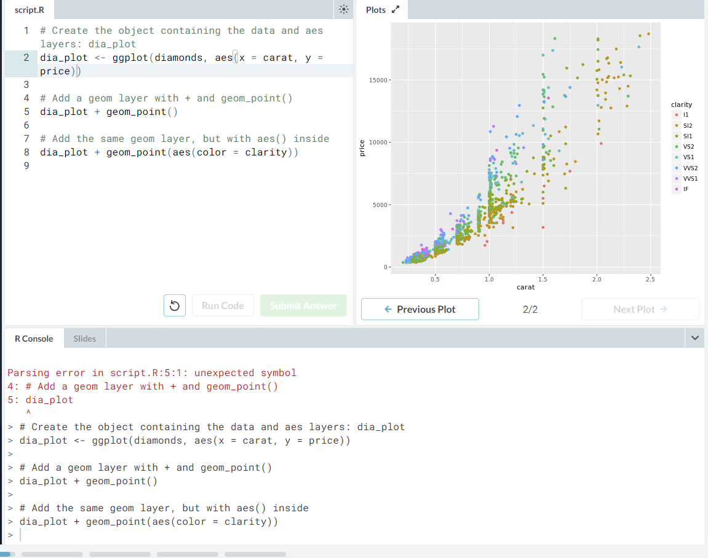
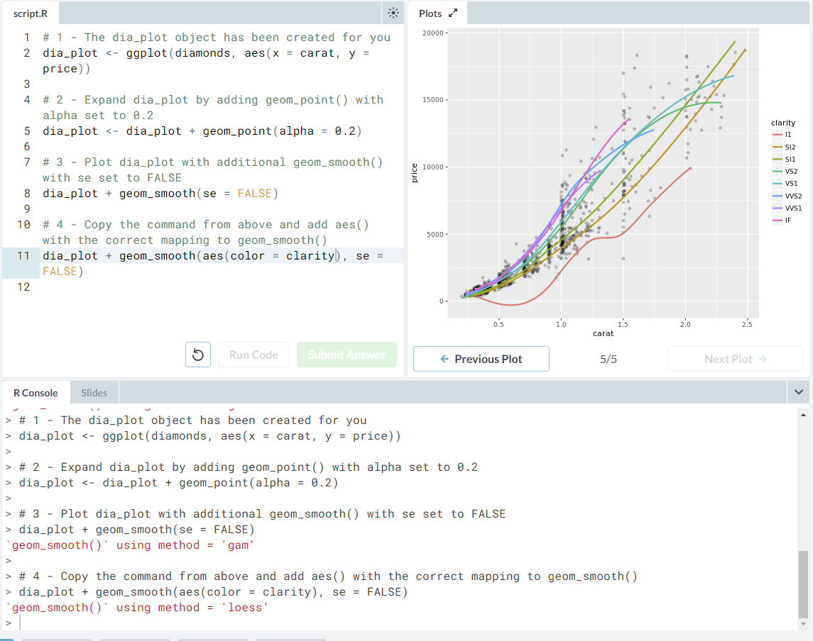

## Part 4: "Multiple and Logistic Regression"
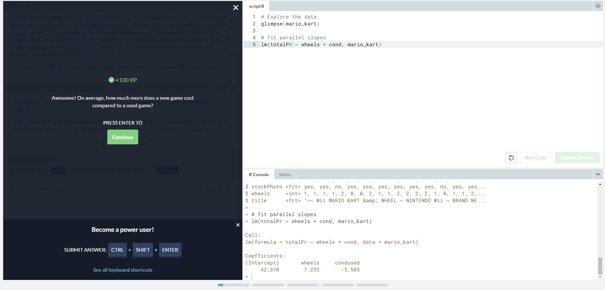
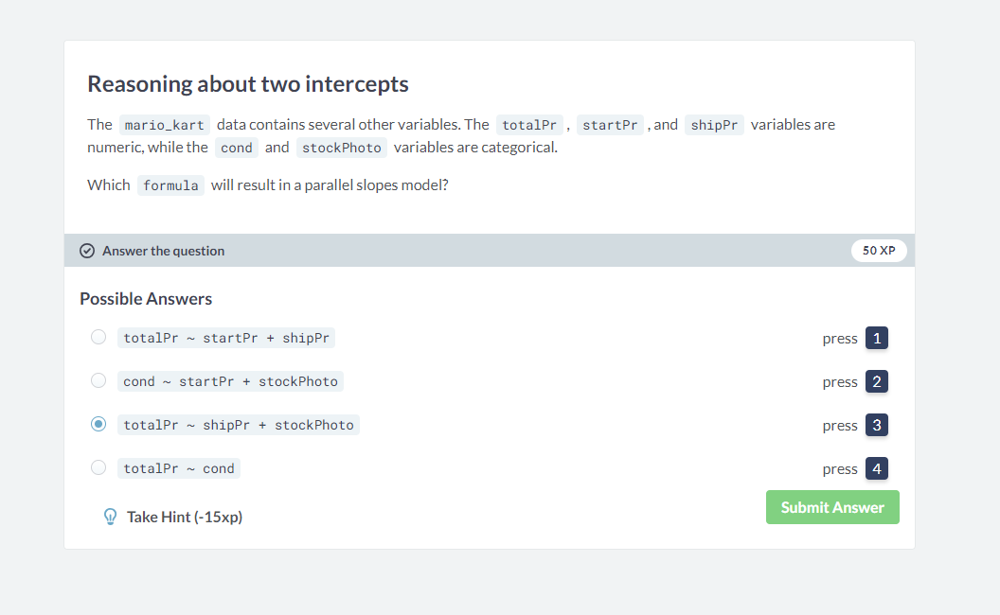
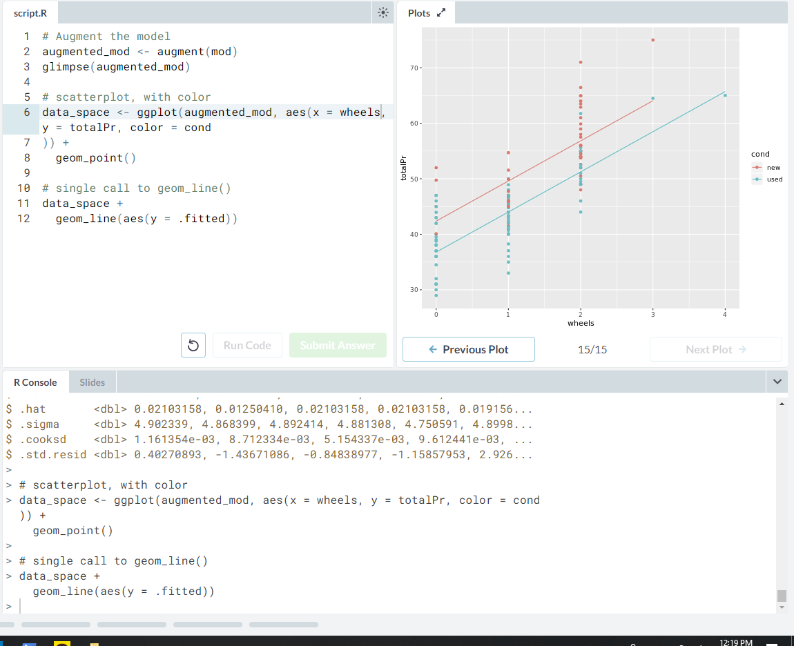

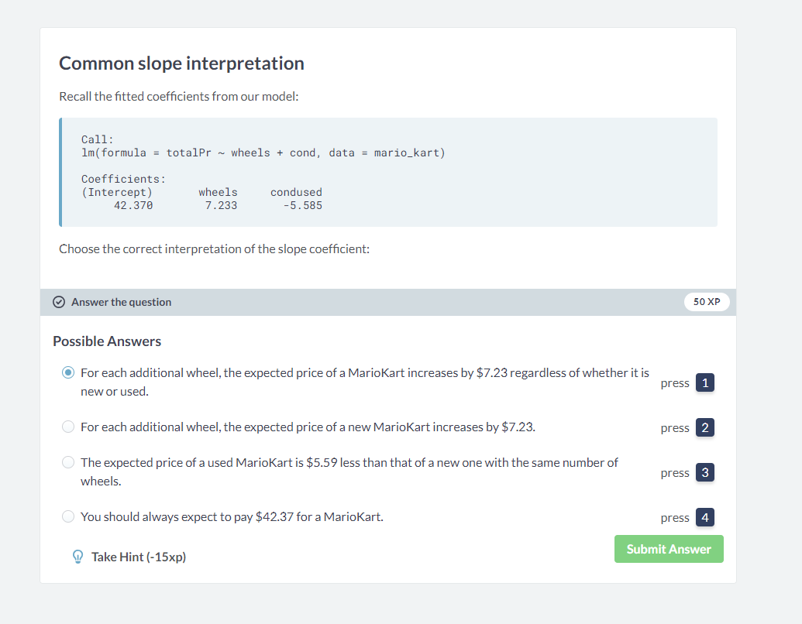
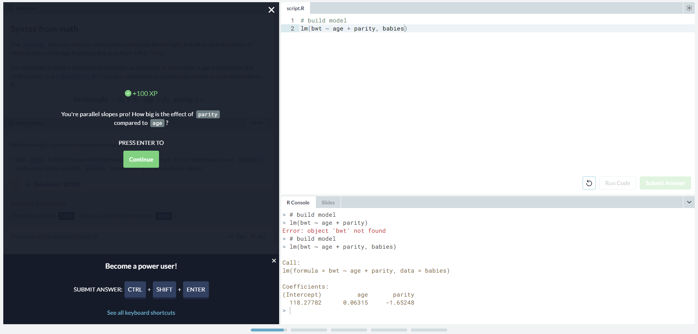
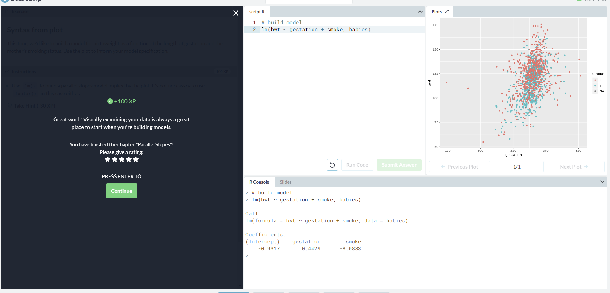

## Part 5: RCOS
Link to the rcos page:
https://rcos.io/projects/meowskers/beirrun/profile
