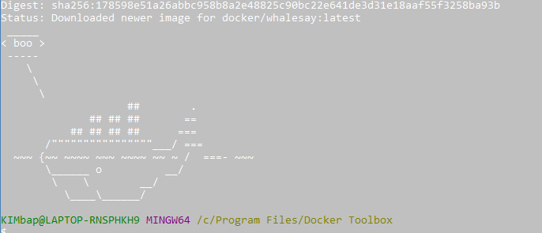
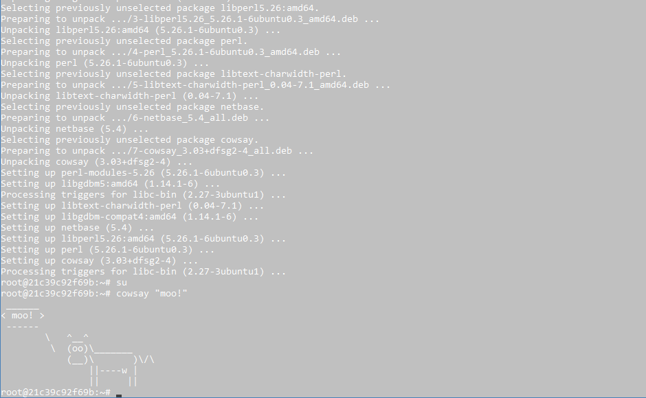
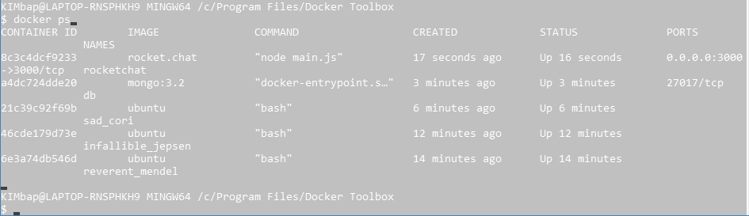
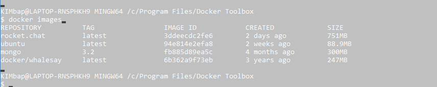
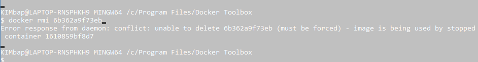
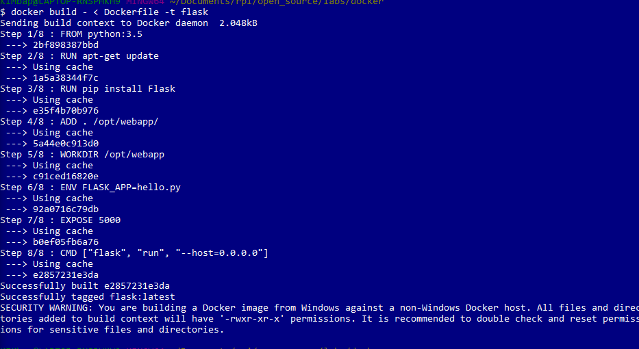
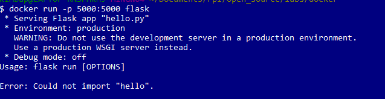
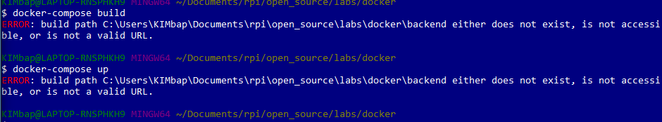

# Issac Kim
# kimi6

## 0
Demonstrating cowsay boo.

## 1
Trying cowsay boo in ubuntu container

## 2
Playing around with rocketchat and other docker functions

## 3
I was able to build, but the app was not running properly.

## 4
yml file. I could not get the docker toolbox to correctly compose the file.

