#Issac Kim\n
#661773259

##c. Reading Assignments
2.
- Break down the response into sections of information so that it is easier
for the person requiring help to digest, rather than one big chunk of
information.
- Unless it is necessary, try to remove technical jargon so that it a less
technical person may understand.
3.
When producing an open source project that is able to be used for a large
user group, it is important to understand how the users manipulate the program.
Since you do not know each individual user, it is imperative to make sure that
your program and the usage of the members align to any laws that could be
infringed on through the use of the program. Before this, as creators, we should
be aware of possible issues that could happen through the maintenance of the
program. In order to mitigate any chance of issues occurring, we should make
it clear to the users and any outsider on the expectations that the creators
have for the users. Another problem that occurred through this is that as open
source software may affect the likes of non-open source companies. In this case,
the non-open source group is likely to have the money to lobby and have more
control in the case that either group infringes on the other. So, we should be
extra careful, especially since we may never know who may take and use our
software.

##d. Linux
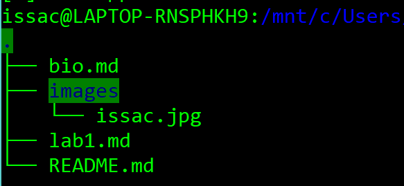

##e. Regex
2.
### RegexOne problems
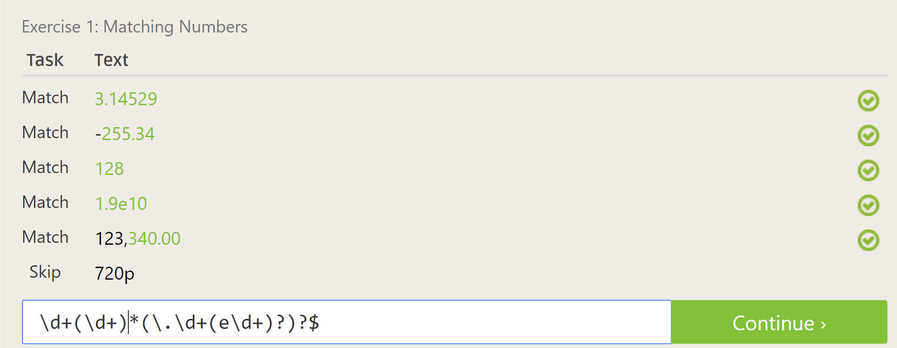
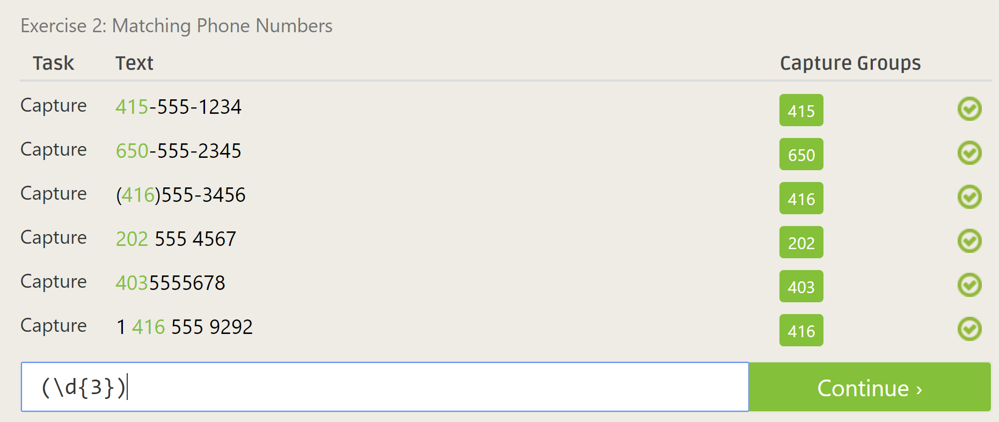
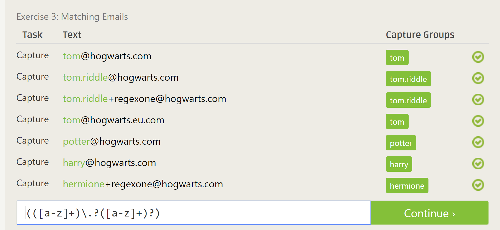
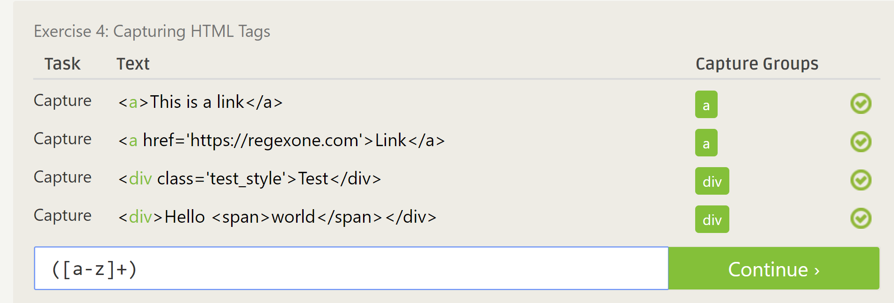
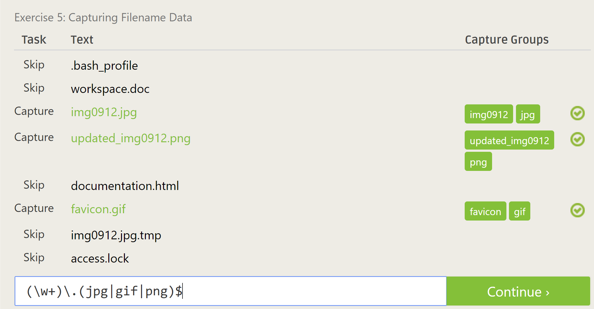
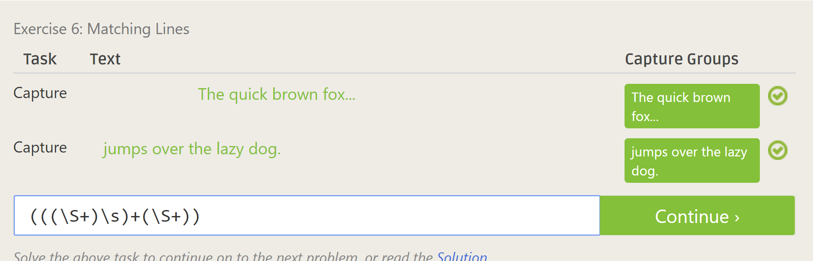
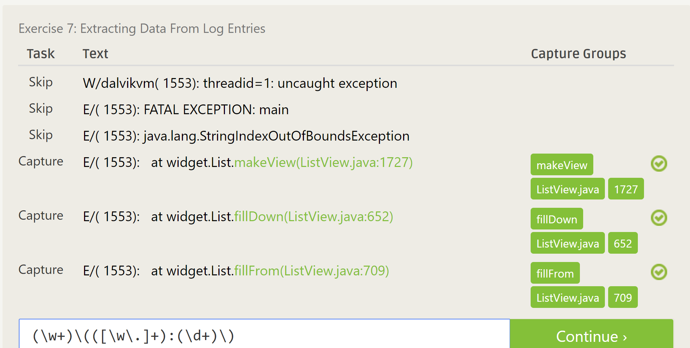
3.
### Regex Crossword problems
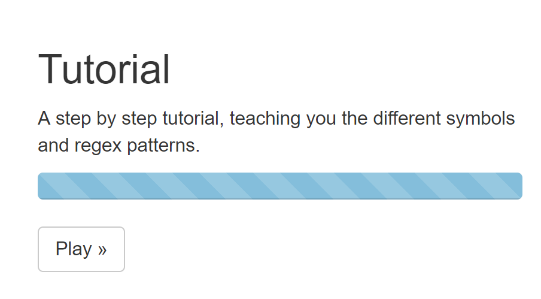
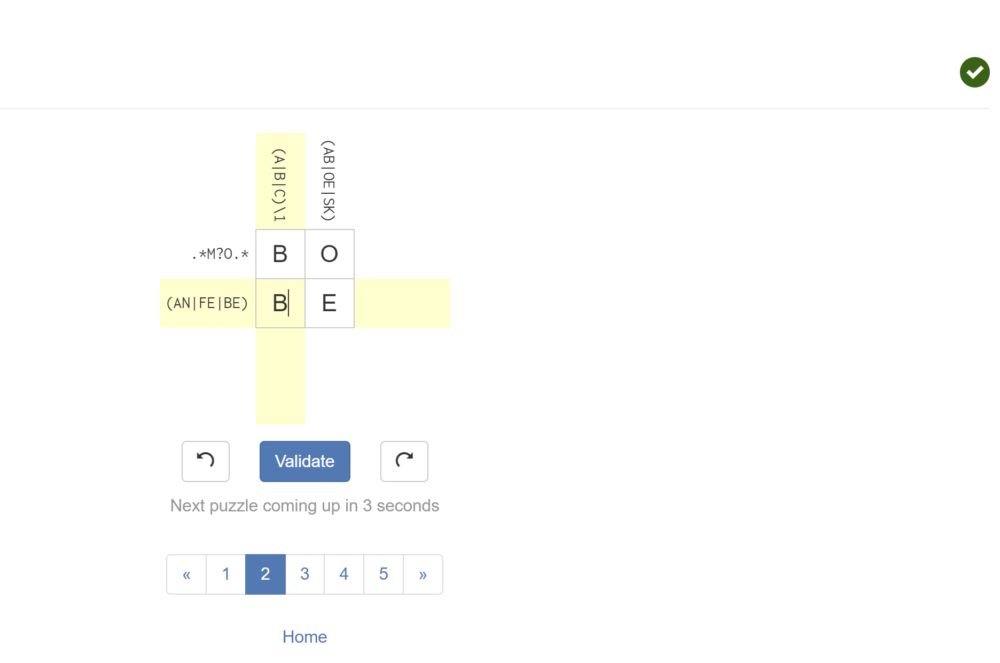
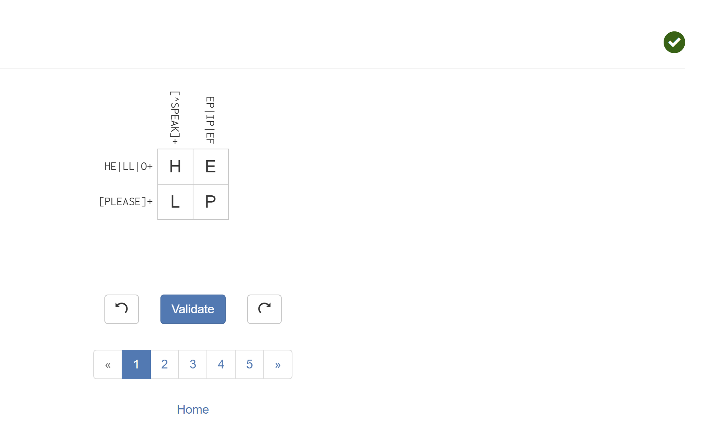

##f. Blockly
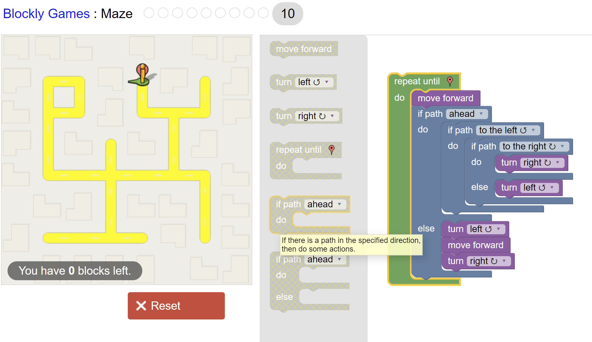

##g. Reflection
Looking through the RCOS projects lists, one project that I found interesting
is the RushMe project that focuses on Greek life. The description of the project
says that the point of the project is to assist Greeks during rush and to
connect the rest of the student body to Greek life. I think that this would be
an interesting project for me to look into because I am a part of the Greek
community and am an active member of my fraternity's rush committee. Also, as
someone who is taking part of the Open Software course, I think that this project
could be something I would want to be a part of now or in the future.
