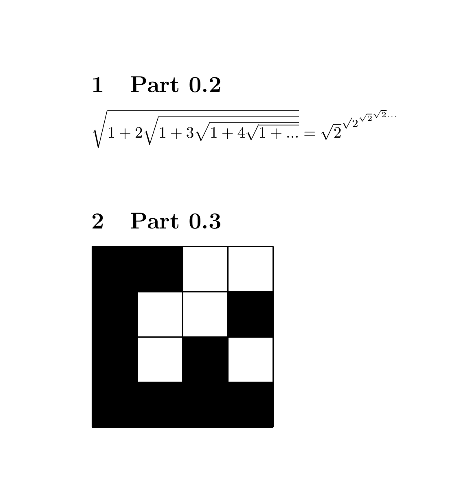
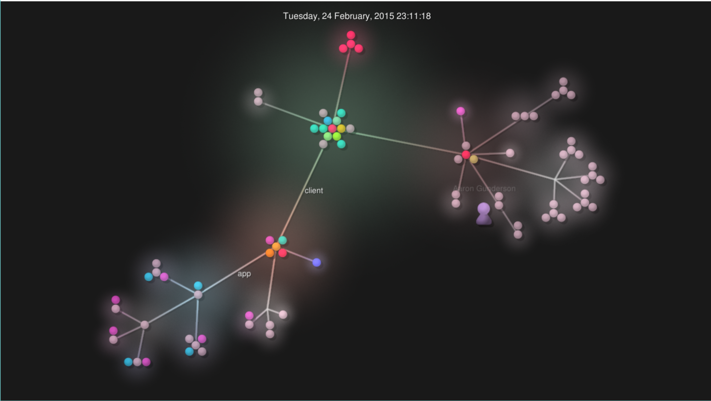
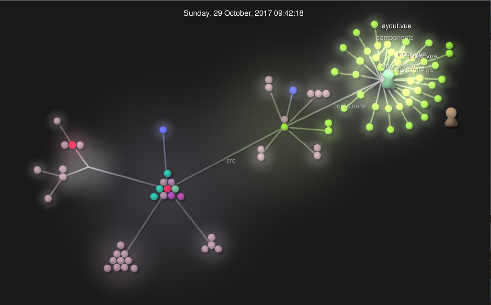

# Issac Kim

# Part 0 (Documentation)
Link to wiki: https://github.com/Issac-Kim/CSCI-4966-Open_Source_Labs/wiki

# Part 1

# MicroFossil Sorter
### Contributors: klingj3, OliviaLundelius, Alexistj
### Lines of code: 109076
### First Commit:
> Author: klingj3
> Date: committed on Jan 26, 2018
> Message: initial commit

### Last Commit:
> Author: alexistj
> Date: alexistj committed on Dec 7, 2018
> Message: half approach.py function documented

### Current Branches:
- master
- Documentation
- WebsiteUpdate

### Differences with GitStats:
- Less lines of code
- More contributors
- https://youtu.be/tFUC57hAZsc

# MxM
### Contributors: 5
### Lines of code: 39059
### First Commit:
> Author: PatrickCelentano
> Date: September 1, 2016
> Message: Initial commit

### Last Commit:
> Author: NicolasCurtis
> Date: March 21, 2018
> Message: Fixed rhythm/pitch parsing triplets

### Current Branches:
- master
- core-develop
- gh-pages
- j-develop
- lilypond-develop
- master
- midi-develop
- n-develop

### Differences with GitStats:
- Less lines of code
- More contributors

# Observatory Server
### Contributors: 42
### Lines of code: 33839
### First Commit:

> Author: Aaron Gunderson <airgunde@gmail.com>
> Date:   Mon Dec 8 21:45:33 2014 -0500
> Message: Initial Commit

### Last Commit:
> Author: Alexander Schwartzberg <aekschwartzberg@gmail.com>
> Date:   Sat Oct 6 12:26:50 2018 -0400
> Message: Sponsors + meeting times & presentation schedule point to handbook

### Current Branches:
- master
- dev
- origin/dev
- revert-759-dev
- ag-update-deploy-script
- yous2
- blogMDEditor
- homepagebuttons
- rememberme
- feature/apidocs
- tagSysteam
- Feature-groupSemesters
- attendance-component
- feature/455
- urp-form
- blogfolders
- vagrant-for-windows
- Gh-pages

### Differences with GitStats:
- Less lines of code 33680 instead of 33839
- More contributors at 60 instead of 42

# Observatory Client
### Contributors: 10
### Lines of code: 19951
### First Commit:
> Author: JHB

>Date: September 26, 2017

### Last Commit:
> Author: Alex Schwartzberg <@aeksco>

> Date: May 4, 2018

### Current Branches:
- master
- dev

### Differences with GitStats:
- Less lines of code 19918 instead of 19951
- More contributors at 13 instead of 10

# Open source Coding Community
### Contributors: Jake-billings, eagraf, koreanwglasses, mdfalkow
### Lines of code: 46670
### First Commit:
> Author: Jake Billings <jake@jakebillings.com>
> Date: Fri Nov 2 16:22:01 2018 -0400
> Message: Initial commit

### Last Commit:
> Author: wdturner
> Date: Jan 29, 2019
> Message: Changing up some dates.

### Current Branches:
- master
- dev

### Differences with GitStats:
- Less lines of code
- More contributors
- https://youtu.be/xn01Tphknjc

# Part 2
